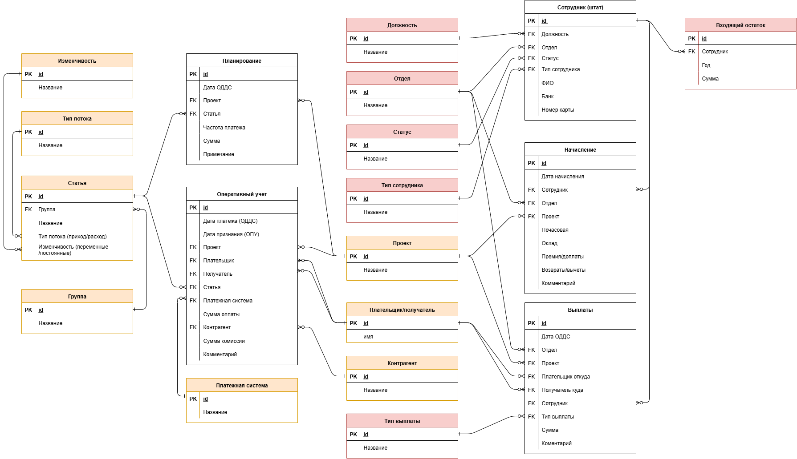

# Приложение для бухгалтерского учета Accounting book

## Описание приложений
    payroll - Зарплатная ведомость
    analytics_dir - Справочник для Аналитики
    contribution - Внесение

## 1. Зарплатная ведомость (payroll)
- Управление сотрудниками и их данными
- Начисления и выплаты 
- Справочники: должности, отделы, статусы, типы сотрудников, типы выплат
- Сводная ведомость: начисления, выплаты и остатки для каждого сотрудника по месяцам
### Основные модели:
* Employee - Сотрудники
* Accrual - Начисления
* Payout - Выплаты
* Position - Должности
* Department - Отделы
* Status - Статусы
* EmployeeType - Типы сотрудника
* PaymentType - Типы выплаты
* OpeningBalance - Входящие остатки

### Страницы приложения payroll:
    Справочник: http://127.0.0.1:8000/payroll/directory/
    Таблица сотрудники: http://127.0.0.1:8000/payroll/all-employees/
    Редактирование записи сотрудника http://127.0.0.1:8000/payroll/edit-employee/<int:pk>/
    Таблица Начисления: http://127.0.0.1:8000/payroll/all-accruals/
    Редактирование записи начисления: http://127.0.0.1:8000/payroll/edit-accrual/<int:pk>/
    Таблица Выплаты: http://127.0.0.1:8000/payroll/all-payouts/
    Редактирование записи выплаты: http://127.0.0.1:8000/payroll/edit-payout/<int:pk>/
    Сводная ведомость: http://127.0.0.1:8000/payroll/summary/

### API для payroll:
    Должности: http://127.0.0.1:8000/payroll/api/positions/
    Отделы: http://127.0.0.1:8000/payroll/api/departments/
    Статусы: http://127.0.0.1:8000/payroll/api/statuses/
    Типы сотрудников: http://127.0.0.1:8000/payroll/api/employee-types/
    Типы выплаты: http://127.0.0.1:8000/payroll/api/payment-types/
    Сотрудники: http://127.0.0.1:8000/payroll/api/employees/
    Начисления: http://127.0.0.1:8000/payroll/api/accruals/
    Выплаты: http://127.0.0.1:8000/payroll/api/payouts/

## 2. Справочник для аналитики (analytics_dir)
- Справочники: проекты, стороны (плательщик/получатель), платежные системы, контрагенты, группы, типы потока, типы изменчивости, статьи

### Основные модели:
* Project - Проекты
* Participant - Стороны (плательщики/получатели)
* PaymentSytem - Платежные системы
* Counterparty - Контрагенты
* Group - Группы
* FlowType - Тип потока (доход/расход)
* Variability - Тип изменчивости (постоянные/переменные)
* Item - Статьи

### Страницы приложения analytics_dir:
    Справочник: http://127.0.0.1:8000/analytics-dir/directory/

### API для analytics_dir:
    Проекты: http://127.0.0.1:8000/analytics-dir/api/projects/
    Стороны (Плательщик/получатель): http://127.0.0.1:8000/analytics-dir/api/participants/
    Платежные системы: http://127.0.0.1:8000/analytics-dir/api/payment-systems/
    Контрагенты: http://127.0.0.1:8000/analytics-dir/api/counterparties/
    Группы: http://127.0.0.1:8000/analytics-dir/api/groups/
    Типы потока: http://127.0.0.1:8000/analytics-dir/api/flow-types/
    Типы изменчивости: http://127.0.0.1:8000/analytics-dir/api/variabilities/
    Статьи: http://127.0.0.1:8000/analytics-dir/api/items/

## 3. Внесение (contribution)
- Оперативный учет и планирование 

### Основные модели:
* OperationalAccounting - Оперативный учет
* Planning - Планирование

### Страницы приложения contribution:
    Таблица Оперативный учет: http://127.0.0.1:8000/contribution/oper-accounting/
    Таблица Планирование: http://127.0.0.1:8000/contribution/planning/

### API для contribution:
    Оперативный учет: http://127.0.0.1:8000/contribution/api/oper-acc-records/
    Планирование: http://127.0.0.1:8000/contribution/api/planning-records/
    
## Схема БД

## Установка и запуск
1. Клонировать репозиторий:
   ```
   git clone https://github.com/malbmarty/accounting_book.git
   cd accounting_book

2. Создать и активировать вирутальное окружение:
    ```
    python -m venv venv
    source venv/bin/activate       # Linux / macOS
    venv\Scripts\activate          # Windows

3. Установить зависимости:
    ```
    pip install -r requirements.txt
4. Применить миграции:
    ```
    python manage.py migrate
  
5. Запустить сервер:
    ```
    python manage.py runserver
    ```

